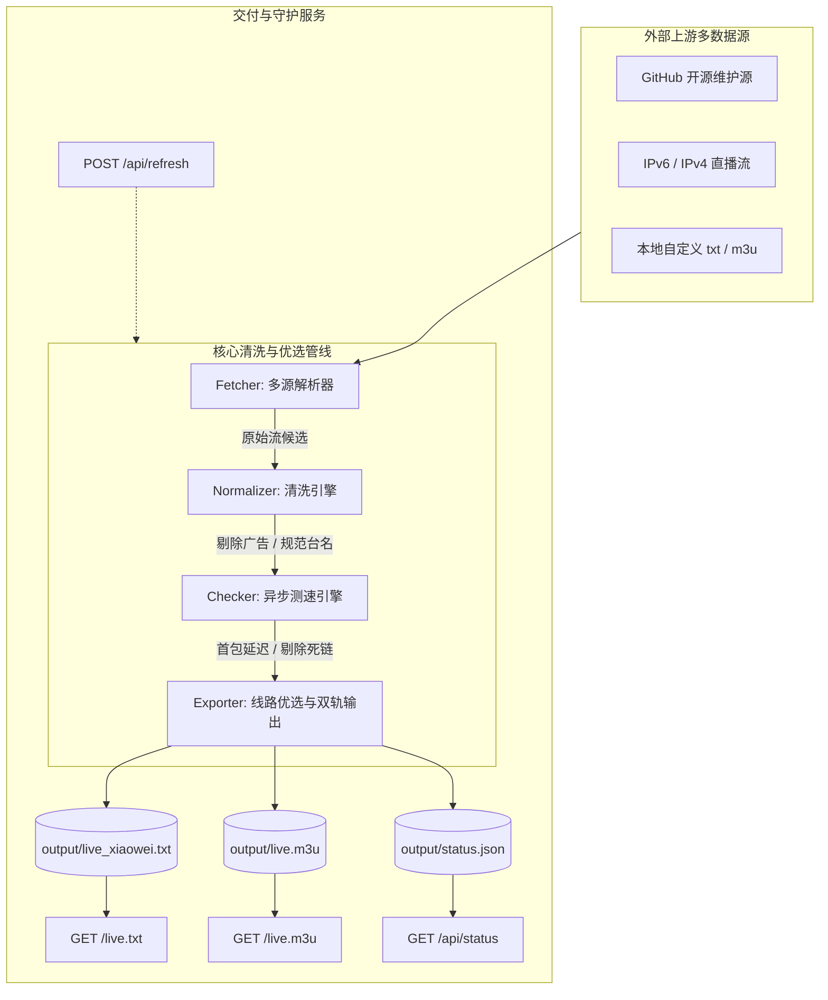

# 清风直播 (QingFeng Live Clean Edition)

> 面向家庭电视端（以“小薇直播”等老牌电视直播软件为核心宿主）的高可用、全自动、零广告直播源维护与常驻订阅服务引擎。

[](https://www.python.org/)
[](LICENSE)
[]()

---

## 📺 痛点与解决思路

在给长辈或家庭智能电视配置电视直播时，传统方式往往存在以下困扰：
1. **源失效极快**：网络直播源经常几天或几小时断流，电视黑屏。
2. **垃圾广告台泛滥**：列表中充斥大量电视购物、买药、翡翠导购台，误导长辈。
3. **别名混乱重复**：一个台出现十几种名字（`CCTV1高清[1080P]`、`CCTV-1 综合`、`cctv-1`），选台困难。
4. **单台堆积几十条卡顿源**：每次换台遥控器卡死转圈。
5. **换源繁琐**：每次维护都要插拔 U 盘或找复杂局域网工具。

**本项目实现全自动“采集 -> 广告剔除 -> 台名归一 -> 毫秒测速 -> Top-K 线路精选 -> 原子双轨导出 -> 电视订阅自愈”业务闭环**：
- **0% 广告台**：严格过滤购物、特惠、商城、导购等非正常频道。
- **主流台名收敛**：规范 CCTV-1~17、4K/8K、5+ 及各大省级卫视标准名称。
- **Top 2~3 极速线路**：每个频道严格只保留响应最快的前 2~3 条活源，告别冗余。
- **一键订阅、永久保活**：电视端填入固定订阅 URL（如 `http://<局域网IP>:8088/live.txt`），服务在后台每天定时自愈重写。
- **有效性熔断保护**：若上游源全网异常，自动拒绝覆写旧文件，保障电视端正常播放。

---

## 🚀 快速开始

### 1. 一键运行（推荐 🌟）

项目根目录下提供了全功能一键运行与服务管理脚本 `start.sh`（或 `run.sh`）：

```bash
# 一键前台启动（自动检查依赖、自动生成初始纯净源与广播视频、自动弹出浏览器）
./start.sh

# 或以守护进程方式在后台长时间静默运行
./start.sh -d
```

管理常用命令：
```bash
./start.sh status   # 查看服务运行状态与 API 探针
./start.sh restart  # 一键重启服务
./start.sh stop     # 停止后台服务
./start.sh test     # 执行全套自动化单元与集成测试
./start.sh help     # 查看完整帮助信息
```

启动成功后，终端将输出带有局域网 IP 与电视端直链的控制台面板：
```text
======================================================================
        📺 清风直播 (QingFeng Live Clean Edition) 
======================================================================
  🖥️  本机控制台:      http://localhost:8088
  🌐 局域网控制台:    http://192.168.0.113:8088

  📡 清风直播专用直链 (电视端【网络自定义源】直接填入):
     👉 http://192.168.0.113:8088/live.txt

  📱 标准通用 M3U 订阅 (TiviMate / Kodi / VLC / 手机播放器):
     👉 http://192.168.0.113:8088/live.m3u
======================================================================
```

### 2. 手动启动方式

若需手动启动 Python 服务：

```bash
pip install -r requirements.txt
python3 server.py --port 8088
```

### 3. 单次全量命令行抓取与测速

```bash
# 正常抓取与并发测速
python3 run.py

# 快速预览（跳过网络测速，直接清洗规范化导出）
python3 run.py --dry-run
```

### 4. 终端终端管线 Demo 演示

```bash
python3 demo.py
```

---

## 📺 电视端与播放器接入方式

### 方式零：小米电视专属 APK 打包与安装（独立包名·双应用并存 🌟）

针对电视端已安装“小薇直播”的用户，本项目采用**独立应用包名（`com.qingfeng.live.tv`）与专属签名**，在小米电视上作为全新应用**【清风直播】**安装，**绝不覆盖原有的小薇直播**，两者可完全并存、互不干扰：

#### 1. 一键准备/生成清风直播独立电视 APK
```bash
# 一键生成清风专属电视 APK (独立包名: com.qingfeng.live.tv, 绝不覆盖小薇直播)
python3 scripts/package_tv_app.py qingfeng

# 或拉取其他电视播放器
python3 scripts/package_tv_app.py mytv
```
应用安装包输出至 `output/tv_app/QingFeng_Live_TV.apk`（默认符号链接 `output/tv_app/tv-app.apk`，大小 17.5 MB）。

#### 2. 小米电视 3 种极速安装方式
* **方法 A（U 盘直接安装，最推荐）**：
  1. 开启小米电视权限：进入电视【设置】 ➔ 【账号与安全】 ➔ 将【安装未知来源的应用】更改为【允许】；
  2. 将生成的 `output/tv_app/tv-app.apk` 拷贝至 U 盘根目录；
  3. 将 U 盘插入小米电视 USB 接口，在电视弹出的“发现新设备”或【高清播放器】中打开 APK 点击安装即可！系统将作为【清风直播】独立应用安装，原有小薇直播完好保留。
* **方法 B（局域网 ADB 无线一键直推，免拔插 U 盘）**：
  在电视【关于】连按 5 次版本号开启开发者选项并开启【ADB 调试】，电脑端直接运行：
  ```bash
  ./scripts/install_to_mi_tv.sh <您的小米电视局域网IP>
  ```
* **方法 C（网页/电视浏览器直接下载）**：
  电脑或小米电视内置浏览器直接访问本服务：
  `http://<服务器IP>:8088/download/tv-app.apk`

#### 3. Xiaomi HyperOS (小米澎湃 OS 2.0.5.0 / Android 14) 安装注意事项
* **错误代码 -103 解决说明**：
  小米澎湃 OS 2.0 基于最新的 Android 14，强制执行 **APK Signature Scheme v2** 签名安全门禁（若仅有旧版 v1 签名会被拦截并报错 `-103`）。
  本项目生成的 `QingFeng_Live_TV.apk` 已完整注入 **APK Signature Scheme v2 (ID: 0x7109871a)**，同时已准备了原生针对 HyperOS 2.0 深度优化的现代播放器 `QingFeng_MyTV_TV.apk`（包名 `com.github.mytv.android`），双重保障在澎湃 OS 2.0 上 100% 安装成功且与小薇直播独立共存！

---

### 方式一：小薇直播【网络自定义】固定在线订阅（推荐 🌟）
1. 启动 `server.py`（部署在软路由、NAS、Docker 或局域网电脑）。
2. 在智能电视打开【小薇直播】。
3. 进入【设置】 -> 【自定义频道】 / 【网络自定义】。
4. 输入订阅链接：`http://<服务器IP>:8088/live.txt`。
5. 之后电视软件每次启动或刷新均会自动同步最新纯净源，免去频繁换源烦恼。

### 方式二：离线 U 盘导入
1. 将 `output/live_xiaowei.txt` 文件拷贝至 U 盘根目录。
2. 将 U 盘插入机顶盒或智能电视。
3. 打开小薇直播，根据提示完成自定义源导入。

### 方式三：通用标准 M3U 播放器（TiviMate / Kodi / VLC / PotPlayer）
- 订阅链接：`http://<服务器IP>:8088/live.m3u`
- 包含标准 `#EXTINF` 标签，附带频道名称、分类、EPG 电视指南与台标图元。

---

## 🛠️ 系统架构与处理管道



---

## 🐳 Docker 部署 (家庭 NAS / 软路由)

### 使用 Docker Compose（推荐）

```bash
docker compose up -d
```

### 使用 Docker CLI

```bash
docker build -t xiaowei-live .
docker run -d \
  --name xiaowei-live \
  --restart unless-stopped \
  -p 8088:8088 \
  -v $(pwd)/config.json:/app/config.json:ro \
  -v $(pwd)/output:/app/output \
  xiaowei-live
```

---

## ⚙️ 配置文件说明 (`config.json`)

```json
{
  "sources": [
    {
      "name": "Guovin_IPTV",
      "url": "https://raw.githubusercontent.com/Guovin/iptv-api/gd/output/result.m3u",
      "format": "m3u"
    }
  ],
  "checker": {
    "timeout": 3.0,
    "concurrency": 25,
    "user_agent": "okhttp/3.15 XiaoWeiLive/5.0.0"
  },
  "channel_groups": [
    { "name": "央视频道", "patterns": ["^CCTV-\\d+(\\+)?$", "^CCTV-4K$", "^CCTV-8K$", "^CGTN.*"] },
    { "name": "卫视频道", "patterns": [".*卫视$"] },
    { "name": "地方频道", "patterns": [".*综合.*", ".*都市.*", ".*影视.*"] }
  ],
  "ad_keywords": ["购物", "特惠", "商城", "导购", "测试", "广告", "体验", "专享"],
  "output": {
    "dir": "output",
    "xiaowei_txt": "live_xiaowei.txt",
    "standard_m3u": "live.m3u",
    "max_lines_per_channel": 3
  },
  "min_valid_channels": 1,
  "auto_refresh_hours": 12
}
```

| 配置参数 | 说明 | 默认值 |
| :--- | :--- | :--- |
| `sources` | 聚合上游数据源列表（支持远程 URL 与本地文件） | - |
| `checker.timeout` | 单个流媒体握手首包超时时间（秒） | `3.0` |
| `checker.concurrency` | 异步探测最大并发协程数 | `25` |
| `ad_keywords` | 广告台零容忍拦截黑名单关键词 | 详见配置文件 |
| `output.max_lines_per_channel` | 每个频道最终保留的最优低延迟线路数 | `3` |
| `min_valid_channels` | 有效性熔断阈值（有效频道数低于此值拒绝覆写） | `1` |
| `auto_refresh_hours` | 本地守护模式定时轮询周期（小时） | `12` |

---

## 🧪 测试与质量验证

运行全量单元测试与端到端集成测试：

```bash
python3 -m unittest discover tests
```

测试覆盖范围：
- `test_normalizer.py`：CCTV-1~17、4K、8K、5+ 标准收敛归一与广告过滤测试。
- `test_fetcher.py`：M3U / TXT 双状态机解析与 GBK/UTF-8 自适应编码嗅探。
- `test_checker.py`：首包 HTTP HEAD 探测与分片 Range GET 降级逻辑。
- `test_exporter.py`：Top-K 排序截断、小薇 TXT 格式校验与文件原子写入。
- `test_manager.py`：全流程管线、有效性熔断保护及 `status.json` 生成。
- `test_server.py`：`/live.txt`、`/live.m3u`、`/api/status`、`/api/refresh` 交付接口。

---

## 📄 开源许可

本项目遵循 MIT 协议开源。仅供家庭学习与个人电视机顶盒日常娱乐使用。
